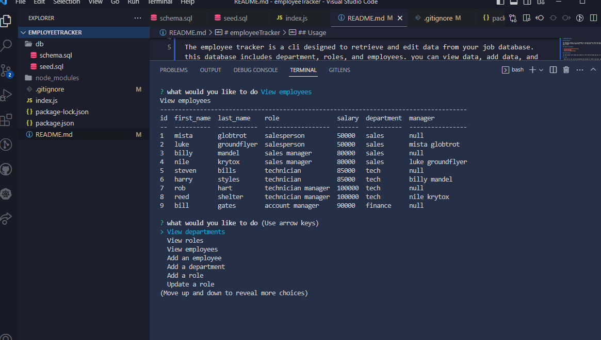

# employeeTracker 

</a>
 

## Description

The employee tracker is a cli designed to retrieve and edit data from your job database. this database includes department, roles, and employees. you can view data, add data, and edit a role.

## Table of Contents

- [Installation](#installation)
- [Usage](#usage)
- [Questions](#Questions)

## Installation

run npm install and create your mysql db. after both are done you can run the file.

## Usage

  when file is ran, you are presented with options to either view data, add data, or edit a role. when clicking on a view option, data is presented. when clicking on a add option, you are presented with questions to add data. when clicking on edit a role, you are asked to choose employee and assign a new role. 

## Questions

JoseTorres26
https://github.com/JoseTorres26

